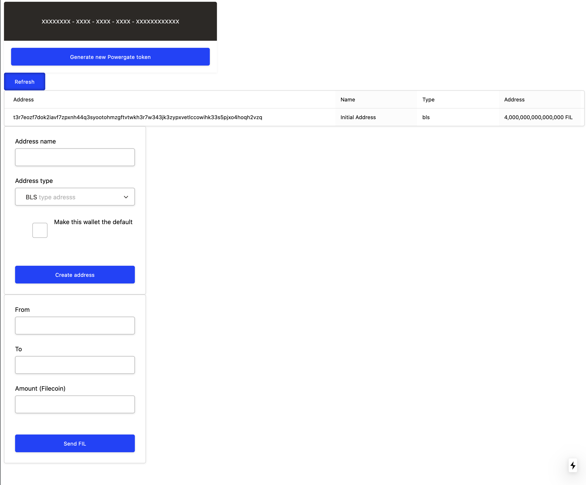

# Powergate ile proje örneği

## Neler bulunuyor
* Cüzdan hesabı oluşturulabiliyor.
* Cüzdanlar arası coin transferi yapılabiliyor.

## Ortamınızı kurun (MacOS)
*  <code>node</code> ve <code>go</code> kurulması gerekir.
* XCode araçlarının kurulması gerekir.
* Powergate entegre edilmesi gerekir.

### Xcode araçlarının kurulumu
```console
$ xcode-select --install
```

### node ve go kurulumu
```console
$ brew install node
$ brew install go
```

### [Powergate kurulumu için ziyaret edin](https://github.com/textileio/powergate)

### Paketlerini kurun
```console
$ yarn
```

### Başlatın
```console
$ yarn next
```

### Ekran Görüntüsü


### Kullanım
